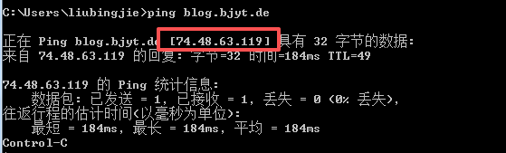
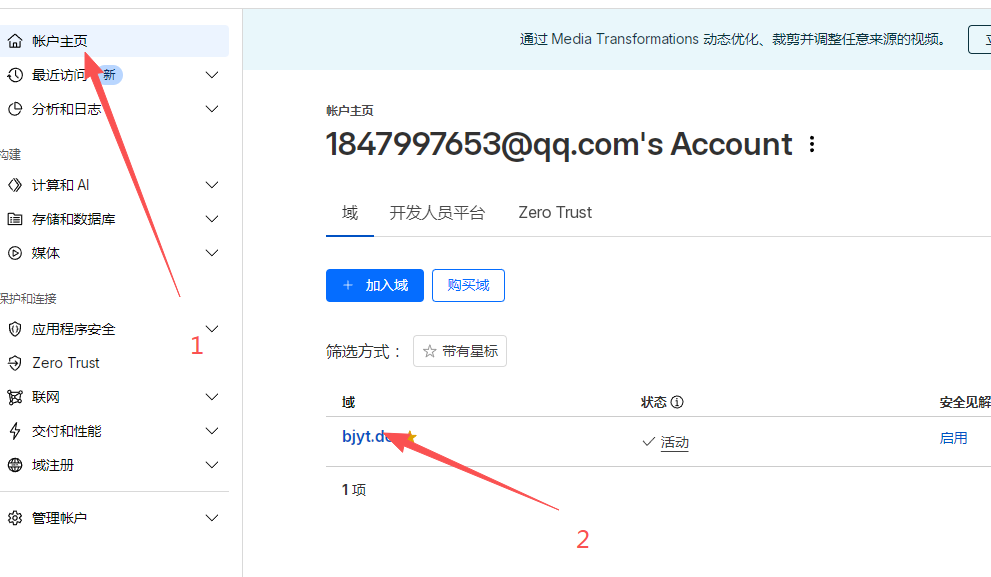
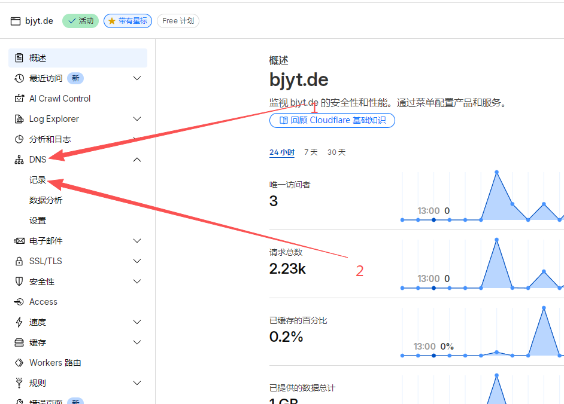
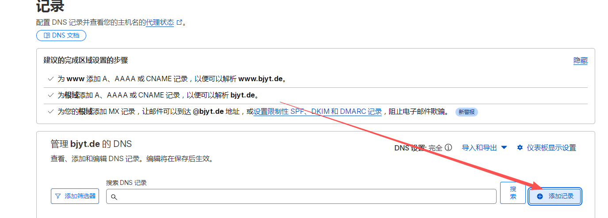
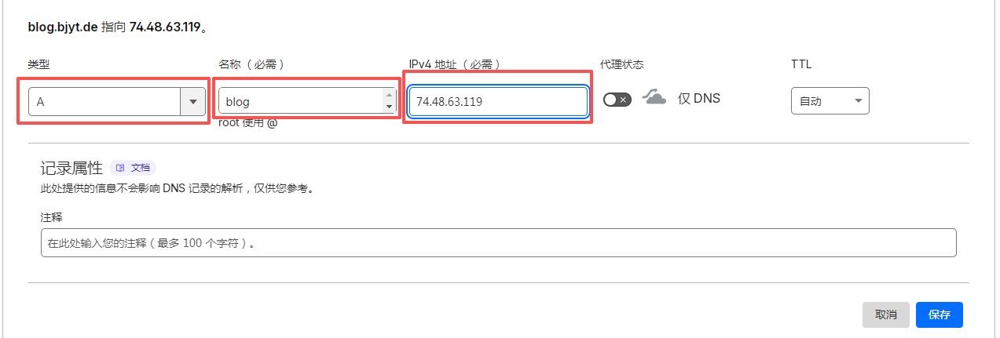

设置dns解析教程

<!-- more -->

# 1.所需实现的效果

首先确定最终要实现的效果是什么样的，比如说我的博客最终是访问  https://blog.bjyt.de
前面的https是协议，你可以先不用管，先着眼于blog.bjyt.de，所谓的dns就是，其实服务器是通过ip访问的，但是你如果都使用ip访问，难记，而且很捞

所以就需要使用dns来进行对应，比如说我这里的  blog.bjyt.de 对应的就是ip 74.48.63.119，怎么确认，使用windows的cmd工具命令，键入以下命令

```
ping blog.bjyt.de
```



这个就是已经解析完成了，而你的域名现在是顶级域名  `mdlldz.de`  所以需要使用二级域名进行解析，像 `www.mdlldz.de` `blog.mdlldz.de` 这种，一个顶级域名可以增加无数个二级域名

# 2.实现

## 1.登录cloudflare

再进入已经加入cloudflare的域名






点击添加记录



选择ipv4地址，名称这里因为是博客，就写blog就行，也可以自定义，看你选择，ip写我服务器的ip 74.48.63.119

我这里写完后左上角就是 `blog.bjyt.de` 你应该是 `blog.mdlldz.de`



记得代理状态要关掉，仅dns就好，等后面教你怎么用他的这个代理实现cdn

然后保存即可

过一会儿，一两分钟，甚至马上去直接ping你刚才设置的二级域名，如果实现和上面的效果，dns解析就是完成了
