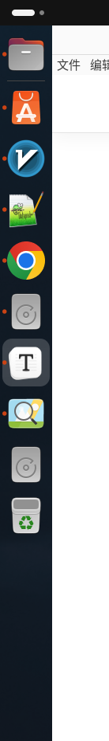
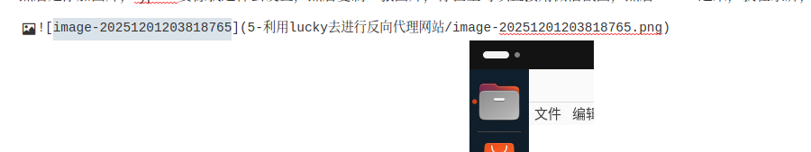

利用lucky去进行反向代理网站

<!-- more -->

## 1.申请证书

在托管域名后，通过lucky进行自动申请证书

完成后直接添加就行，比如这个就是我中午为你申请的证书，因为申请的是 *.mdlldz.de,所以  *  无论是什么，都能够匹配，比如你博客的域名是blog.mdlldz.de他也能够使用

将反向代理的域名指向服务器，这个你中午已经做了

## 2.开始配置反向代理

你看，解析的ip是不是和我的服务器是对上的，，然后进行配置

那此处进行配置就比较简单，创建一个主的规则，主要是监听443端口，你只要记住，我们平时浏览的网页，前面都有协议，比如 http  https 这两种

http是不加密的，别人如果抓包，就能够看到你传输的内容是什么

https是加密的，就算抓包，没有证书（就是上面申请的那个），别人也不知道我们传输的是什么内容，所以证书不能随便传，包括ssh密钥也是

这里看我的博客，就是https的，在录屏，无法截图

接下来进行配置

比如我现在有一个这样的地址  http://158.69.244.4:3000/，我不希望每次都输入这么完整的ip，我希望通过https://movie.bjyt.de进行访问

就进行这样的配置,这样就行了，很简单

反向代理其实就是，比如我的githubpage地址， 他访问并不稳定，因为有墙，所以经常连不上，这时候，我的服务器是能够稳定连上的，那我就用我的服务器作为跳板，服务器去浏览内容，然后呈现在我眼前这种感觉，相当于服务器做一个中继

当我们访问

https://movie.bjyt.de

等价于访问 https://movie.bjyt.de:443,然后一解析，等价访问 http://74.48.63.119:443 
https默认端口是443,http默认端口是80,就是你不带端口，他会默认的一个端口

那我的主规则监听的是443,所以就会自动接收到这个请求

然后由于我添加了这个规则，我的服务器就知道，当请求的地址是用movie.bjyt.de请求时，我就要代理 http://158.69.244.4:3000/给他，所以就实现了

两个是完全一样的网站

然后是添加图片，typora要像我这样去设置，然后复制一张图片，你甚至可以直接用微信截图，然后curl +v进来，我在录屏，无法截图，所以我去复制一张图片

截图进去之后，这样的地址格式才是对的，` 5-利用lucky去进行反向代理网站/image-20251201203847206.png` 

/前面是我们刚才说的那个文件夹地址，后面图片名称，然后typora能够正常显示图片，刚才截图了一下放了上去，图片的连接要保持这样，你看而且文件夹里也有对应的图片，这样子就行了，然后curl + s保存，或者文件，保存就行
