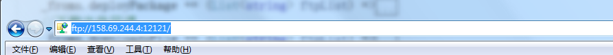
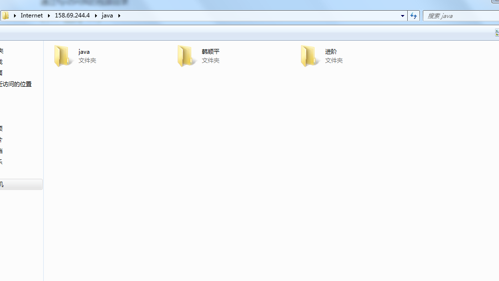

通过ftp访问我的视频目录

<!-- more -->

# 一、基本信息

1. ftp地址  => ftp://158.69.244.4:12121
1. 用户名 => lsj
1. 密码 => mdlldz

# 二、使用

在文件夹的地址中输入  ftp://158.69.244.4:12121

如果出现账号密码验证，正常输入账号密码，点击保存密码后下次就不需要输入

就像本地文件夹一样，具体使用取决于你的网速，服务器在海外，所以需要挂梯子，如果挂了梯子还是很慢，记得把全局打开，实在不行就开启Tun模式

